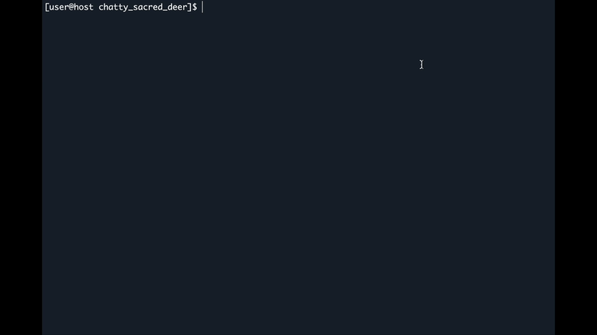

# Болтливый Сакральный Олень
Узнай ответ на любой вопрос или просто поговори с Мудрейшим.

- 🌈 эмоционален
- 🤝 готов поддержать
- 🌧️ или расстроить
- 💬 иногда болтлив
- 💭 иногда задумчив
- ... и всё это с инто. нацией. 🎆

_Ускоренное демо_

# Установка
Сакральный Олень устроен на чистом Python. Всё, что нужно, это `Python версии 3.6+` и терминал, поддерживающий 256 ANSI-цветов.

Есть два способа установки.

1. Cкачать: `Clone or download -> Download ZIP`.
2. Склонировать: `git clone https://github.com/stepanzh/chatty_sacred_deer.git`.

# Запуск
После установки перейдите в папку с Мудрейшим и попросите помощи командой `python3 ask.py -h`.

Дальше вы сами 🙂

# Напоследок...

Если вам понравился проект, поддержите меня звёздочкой гитхаба ⭐.

Это сильно увеличит шансы на добавление новых фич!
